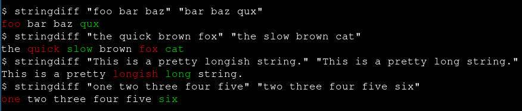

## Overview

<p align="center">
  
</p>

TODO

## Features

- TODO
- TODO
- TODO
- TODO
- TODO
- TODO
- TODO
- TODO
- TODO
- TODO

## Setup

TODO

## Usage

```
TODO
```

## Examples

TODO

## License

This work is licensed under the GNU General Public License version 3 (GPLv3).

[](https://www.gnu.org/licenses/gpl-3.0.en.html)
